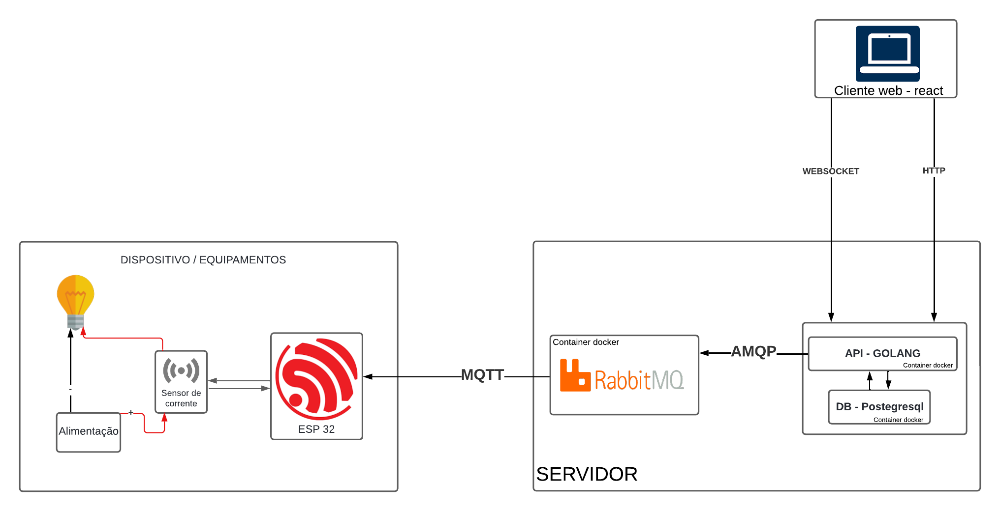
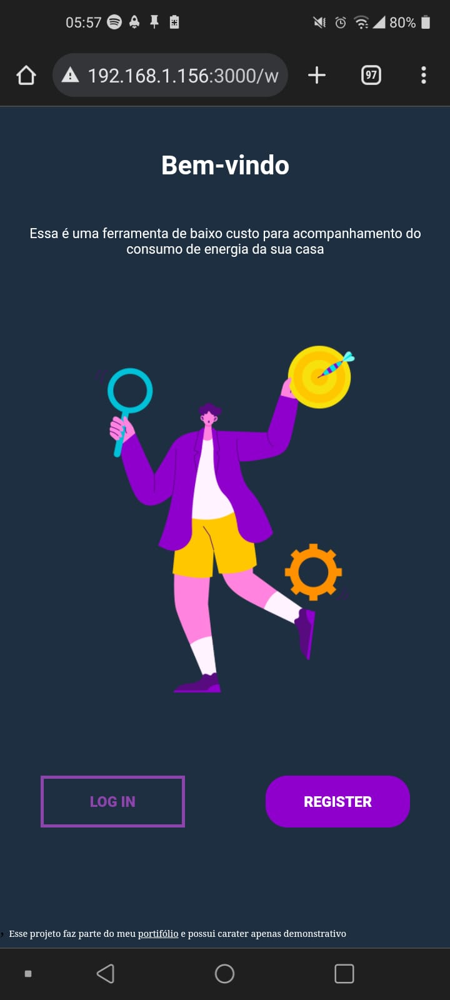
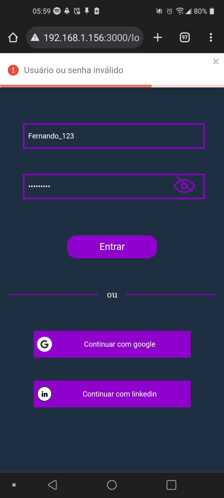

# Candieiro

Sistema voltado para o controle do consumo de energia, permitindo o monitoramento em tempo real e análise de histórico
Esse sistema faz parte do meu portifólio e tem a proposta de permitir o controle de consumo de energia em tempo real através da integração de um dispositivos de medição, uma API e um cliente Web. Todos os componentes da aplicação serão desenvolvidos internamentes e serão disponibilizados nesse repositório a medida que sejam finalizados.

## ✔️ Técnicas e tecnologias utilizadas

- ``Golang``
- ``Postegresql``
- ``WebSocket``
- ``Rest``
- ``Rabbitmq``
- ``ReactJs``
- ``Esp32``
- ``C++``

# :hammer:  Funcionalidades do projeto
    * Login
    * Cadastro de usuários
    * Visualização de pontos de consumo
    * Cadastrar ponto de consumo
    * Atualizar ponto de consumo

### Overview

### Telas

  
# Estrutura do projeto

O sistema é formado por três componentes que trabalham em conjunto para permitir que o objetivo descrito anteriormente seja alcançado. Esses componentes são:

* Dispositivo
     O dispositivo tem como responsabilidade coletar o consumo de determinado equipamento e realizar o envio dessa informação para o servidor. Ele deve também realizar desligamentos programados em determinados períodos.
* Api
     A api tem como responsabilidade ser o intermediário entre os clientes e os pontos de consumo, precisando assim disponibilizar um interface para cada. 
     A interface com o dispositivo deve ser capaz de realizar o processamento dos dados recebidos assim como o envio de comandos de desligamento.
     A interface com cliente deve disponibilizar meios para que o mesmo acesse os registros de consumo dos pontos que lhe forem permitidos assim como a configuração dos mesmos

* Front end
     O front end tem como responsabilidade disponibilizar meios para que o cliente final visualize o consumo das plantas que lhe pertencerem, permitindo a análise do histórico de consumo e o consumo em tempo real da sua planta. Os clientes devem ser capazes de criar plantas e pontos, assim como realizar a configuração dos mesmos

## Contratos de interfaces:

### Dispositivos:

* Os dispositivos devem realizar o envio do consumo atual e do consumo por período, sendo que o consumo atual deve ser enviado sempre que houver variação no consumo, enquanto o consumo por período deve ser enviado de acordo intervalo de tempo configurado. Além dessas informações o equipamento deve informar sobre seu estado de funcionamento. Os dados devem seguir o seguinte padrão:
 

1. Consumo atual: 
**{"kw_h": number, "time": number, "serialNumber": number}**
 

2. Consumo por intervalo: 
**{"kw": number, "startTime": number, "endTime": number, "serialNumber": number}**

3. Funcionamento:  
**{"on": boolean, "time": number, "deviceId": number}**

* Além das informações enviadas o dispositivo também aceita comandos de desligamento na seguinte estrutura:

1. Desligamentos:  
**{"startTime": number, "endTime": number, "recurrent": boolean}**
